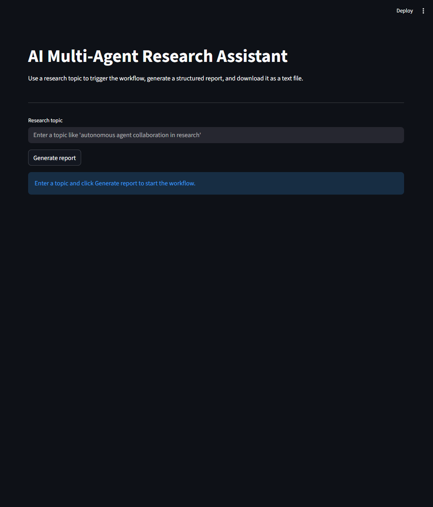
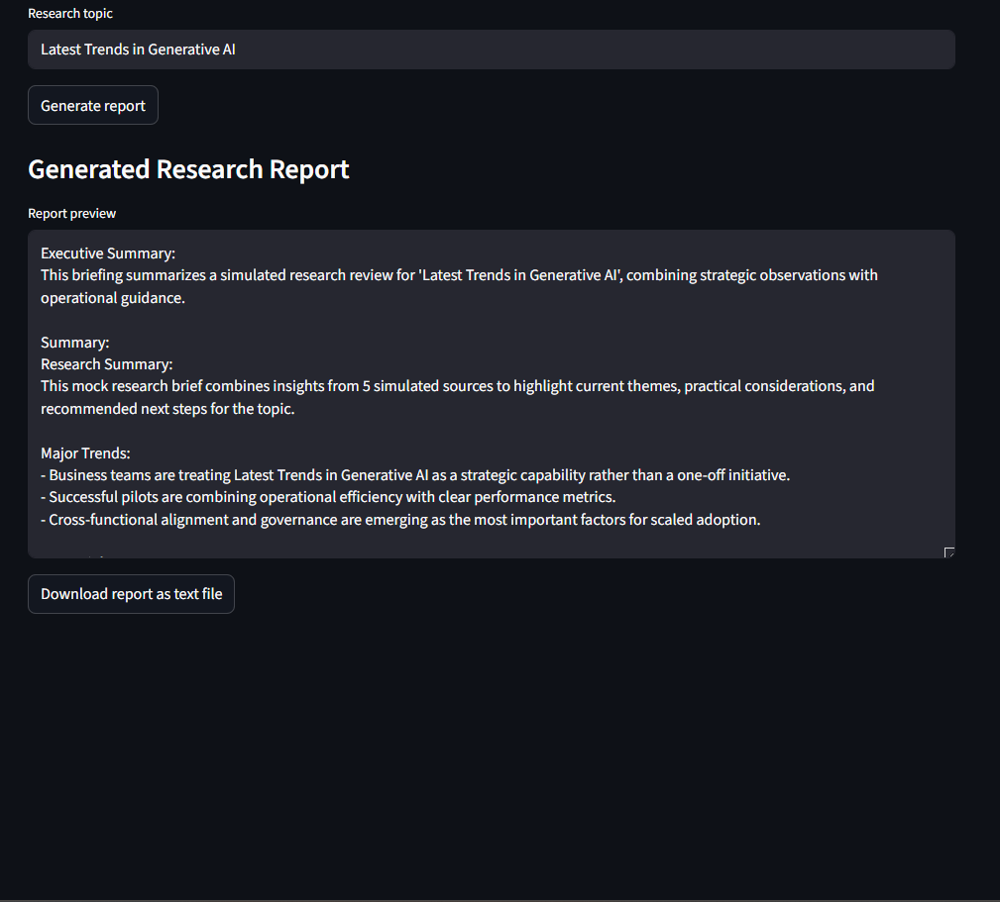
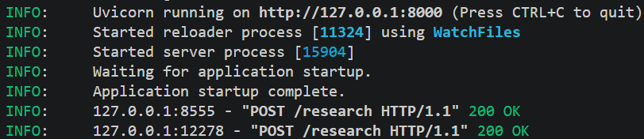

# AI Multi-Agent Research Assistant

A beginner-friendly demonstration of a modular, multi-agent research workflow that runs entirely locally using simulated AI responses.

This repository shows how a small set of cooperating agents can be composed to perform research automation, summarization, and report generation without relying on external APIs.

Key features
- Modular agent design: clear separation between research, summarization, and report-generation responsibilities.
- Local-first: simulated AI outputs so the project runs without API keys or external services.
- FastAPI backend and Streamlit frontend for an interactive demo experience.
- Persistent local memory using ChromaDB for storing and retrieving research reports.

What this project demonstrates
- Agentic AI workflow orchestration
- Research automation and information synthesis
- Summarization pipelines and downstream report generation
- A beginner-friendly, reproducible local development setup

---

**Table of contents**

- Overview
- Architecture
- Agents
- Workflow
- Folder structure
- Installation
- Local setup
- Running the backend
- Running the Streamlit frontend
- Screenshots
- Sample output
- Future improvements
- Tech stack
- Why simulated AI workflows

---

## Architecture overview

The project is organized around a simple pipeline of agents:

- `ResearchAgent` — gathers domain information (simulated) and prepares source notes.
- `SummarizerAgent` — consumes raw findings and produces a concise, structured summary.
- `ReportGeneratorAgent` — produces a polished business-style report suitable for stakeholders.

These agents are orchestrated by the API layer (`api.py` / `agents.workflow`) and exposed to the user via a Streamlit frontend (`app.py`). Memory is persisted locally in a ChromaDB collection so outputs can be queried later.

## Agents

- Research Agent
  - Purpose: collect and normalize source-level information for a given topic.
  - Behavior: returns curated, realistic mock search results with short summaries, sources, and publication dates.
  - Output: a structured findings document used by subsequent agents.

- Summarizer Agent
  - Purpose: convert a findings document into a concise summary highlighting trends, insights, and action items.
  - Behavior: lightweight parsing and formatting to produce recruiter-friendly summary bullets.
  - Output: a short, professional summary appropriate for inclusion in a report.

- Report Generator Agent
  - Purpose: produce a business-ready briefing that includes an executive summary, key takeaways, strategic considerations, and recommended next steps.
  - Behavior: combines summary and insight text into a readable, stakeholder-focused report.

## Workflow

1. User enters a research topic in the Streamlit UI.
2. Frontend calls the FastAPI `/research` endpoint.
3. Backend runs `run_research_workflow(topic)`, which sequentially invokes:
   - `ResearchAgent.execute(topic)` → raw findings
   - `SummarizerAgent.execute(raw_findings)` → summary
   - `ReportGeneratorAgent.execute(topic, summary, raw_findings)` → report
4. Result returned to frontend and stored in ChromaDB for later retrieval.

## Folder structure

```
AI-Multi-Agent-Research-Assistant/
├─ agents/                # Research, summarizer, report generator, workflow orchestration
├─ memory/                # ChromaDB storage helpers
├─ tools/                 # Mock search / utilities
├─ screenshots/           # UI and example screenshots
├─ app.py                 # Streamlit frontend demo
├─ api.py                 # FastAPI backend exposing research endpoint
├─ requirements.txt       # Python dependencies
├─ .env                   # Local configuration (no API keys required)
├─ README.md
```

## Installation

1. Clone the repository.
2. Create and activate a Python virtual environment (recommended Python 3.10+).

```bash
python -m venv .venv
# Windows PowerShell
.\.venv\Scripts\Activate.ps1

# macOS / Linux
source .venv/bin/activate
```

3. Install dependencies:

```bash
pip install -r requirements.txt
```

## Local setup

No API keys or cloud services are required. The project uses simulated AI responses by default.

If you want to change persistence location, edit `.env` and set `CHROMA_PERSIST_DIR`.

## Running the backend

Start the FastAPI server (development mode):

```bash
.\.venv\Scripts\python.exe -m uvicorn api:app --reload
```

The API exposes a health check at `GET /health` and the research endpoint at `POST /research`.

## Running the Streamlit frontend

In a separate terminal (with the virtual environment active):

```bash
.\.venv\Scripts\python.exe -m streamlit run app.py
```

The UI provides a single input field for a research topic and a button to run the workflow. Generated reports can be previewed and downloaded.

## Screenshots

Home page


Generated report preview


Backend running (uvicorn)


> Note: screenshots are included in the repository under `screenshots/`.

## Sample output

Below is an excerpt from a generated report for the topic `autonomous agent collaboration in research`:

```
Executive Summary:
This briefing summarizes a simulated research review for 'autonomous agent collaboration in research', combining strategic observations with operational guidance.

Summary:
Research Summary:
This brief combines insights from 5 curated sources to highlight current themes, practical considerations, and recommended next steps for the topic.

Major Trends:
- Business teams are treating autonomous agent collaboration as a strategic capability rather than a one-off initiative.
- Successful pilots combine operational efficiency with clear performance metrics.
- Cross-functional alignment and governance are emerging as the most important factors for scaled adoption.

Key Takeaways:
... (concise insights and recommended next steps)
```

## Future improvements

- Replace mock agents with real LLM integrations (openai, etc.) behind a configurable toggle.
- Add unit and integration tests for agent components and the FastAPI endpoints.
- Improve memory indexing and retrieval with richer metadata and vector search tuning.
- Add end-to-end demo that runs example topics and stores results for QA.

## Tech stack

- Python 3.10+
- Streamlit — lightweight interactive UI
- FastAPI — backend orchestration and API
- ChromaDB — local vector/document memory (DuckDB+Parquet persistence)
- dotenv — environment configuration

## Why simulated AI workflows?

This repository intentionally uses simulated AI responses to make the project fully runnable offline and accessible to learners and recruiters without requiring API access or billing. The mock workflow preserves the architectural patterns, interfaces, and orchestration logic of a real multi-agent system while enabling safe, low-friction exploration.

If desired, the codebase is structured so real LLM clients can be added later behind thin adapter layers.

---

If you'd like, I can also add example unit tests, CI configuration, or a script that seeds the ChromaDB store with sample reports to make the demo turnkey.
